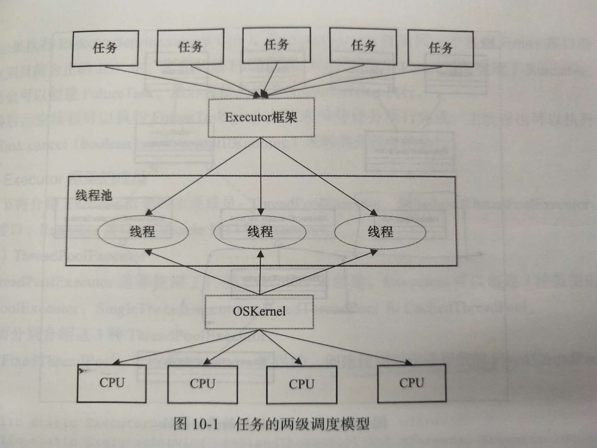
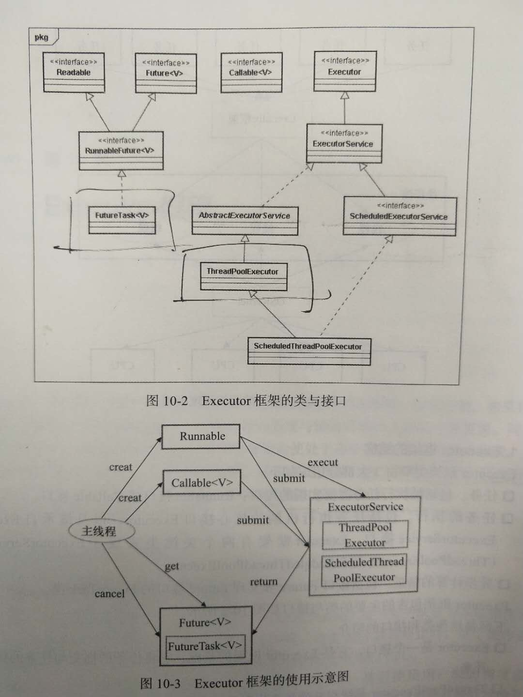

## 线程池
好处：
>* 重复利用已经创建的线程降低线程创建销毁的开销 
>* 任务到达时可以不需要等到线程创建就能立即执行
>* 线程池对线程统一分配，调优和监控--提高线程的可管理性

### 实现原理
#### 处理流程
当一个任务被提交到线程池的时候：
1. 线程池判断核心线程池里的线程是否都在执行任务。如果不是，new一个新的工作线程来执行任务(需要获取全局锁)；如果是，进入下一个流程   
2. 线程池判断工作队列是否已满，如果没有满，则将新提交的任务存储在这个工作队列中。如果满了，进入下一个流程
3. 线程池判断线程池的线程是否都处于工作状态，如果没有，创建一个新的工作线程来执行任务(需要获取全局锁)；如果满了，则交给饱和策略来执行这个任务   

这也反应在ThreadPoolExecutor.execute(Runnable)的源码中。  
还有关于工作线程的职责有两点：执行当前任务和循环从BlockingQueue中获取任务来执行。                                                                                                                                                                                       nnnunnnnnnnnnnnnnnnnnnnnnnnnnnnnnnnnnnnnnnnnnnnnnnnnnnnnnnnnnnnnnnnnnnnnnnnnnnnnnnnnnnnnnnnnnnnnnnnnnnnnnnnnnnnnnnnnnnnnnnnnnnnnnnnnnnnnnnnnnnnnnnnnnnnnnnnnnnnnnnnnnnnnnnnnnnnnnnnnnnnnnnnnnnnnnnnnnnnnnnnnnnnnnnnnnnnnnnnnnnnnnnnnnnnnnnnnnnnnnnnnnnnnnnnnnnnnnnnnnnnnnnnnnnnnnnnnnnnnnnnnnnnnnnnnnnnnnnnnnnnnnnnnnnnnnnnnnnnnnnnnnnnnnnnnnnnnnnnnnnnnnnnnnnnnnnnnnnnnnnnnnnnnnnnnnnnnnnnnnnnnnnnnnnnnnnnnnnnnnnnnnnnnnnnnnnnnnnnnnnnnnnnnnnnnnnnnnnnnnnnnnnnnnnnnnnnnnnnnnnnnnnnnnnnnnnnnnnnnnnnnnnnnnnnnnnnnnnnnnnnnnnnnnnnnnnnnnnnnnnnnnnnnnnnnnnnnnnnnnnnnnnnnnnnnnnnnnnnnnnnnnnnnnnnnnnnnnnnnnnnnnnnnnnnnnnnnnnnnnnnnnnnnnnnnnnnnnnnnnnnnnnnnnnnnnnnnnnnnnnnnnnnnnnnnnnnnnnnnnnnnnnnnnnnnnnnnnnnnnnnnnnnnnnnnnnnnnnnnnnnnnnnnnnnnnnnnnnnnnnnnnnnnnnnnnnnnnnnnnnnnnnnnnnnnnnnnnnnnnnnnnnnnnnnnnnnnnnnnnnnnnnnnnnnnnnnnnnnnnnnnnnnnnnnnnnnnnnnnnnnnnnnnnnnnnnnnnnnnnnnnnnnnnnnnnnnnnnnnnnnnnnnnnnnnnnnnnnnnnnnnnnnnnnnnnnnnnnnnnnnnnnnnnnnnnnnnnnnnnnnnnnnnnnnnnnnnnnnnnnnnnnnnnnnnnnnnnnnnnnnnnnnnnnnnnnnnnnnnnnnnnnnnnnnnnnnnnnnnnnnnnnnnnnnnnnnnnnnnnnnnnnnnnnnnnnnnnnnnnnnnnnnnnnnnnnnnnnnnnnnnnnnnnnnnnnnnnnnnnnnnnnnnnnnnnnnnnnnnnnnnnnnnnnnnnnnnnnnnnnnnnnnnnnnnnnnnnnnnnnnnnnnnnnnnnnnnnnnnnnnnnnnnnnnnnnnnnnnnnnnnnnnnnnnnnnnnnnnnnnnnnnnnnnnnnnnnnnnnnnnnnnnnnnnnnnnnnnnnnnnnnnnnnnnnnnnnnnnnnnnnnnnnnnnnnnnnnnnnnnnnnnnnnnnnnnnnnnnnnnnnnnnnnnnnnnnnnnnnnnn7程的**职责**有两点：执行当前任务和循环从BlockingQueue中获取任务来执行   
**理解概念**：corePoolSize，BlockingQueue，maximumPoolSize     

#### 线程池的使用
**创建**：    
```text
new ThreadPoolExecutor(corePoolSize, maximumPoolSize, keepAliveTime, milliseconds, runnableTaskQueue, handler)
```
handler -- RejectedExecutionHandler(饱和策略)：默认直接抛出异常，当然还有其他策略：脑补。   
**向线程池提交任务**：    
可以使用execute()方法和submit()方法
execute()用于提交没需要返回值的方法，所以无法判断任务是否被线程池执行成功：
```text
threadsPool.execute(new Runnable() {
  run() {
    //xxx
  }
});
```
submit()方法用于提交需要返回值的任务。线程池会返回一个future类型的对象，通过这个future对象可以判断任务是否执行成功，并且可以通过future的get()方法来获取返回值，
get()方法会阻塞当前线程直到任务完成，get(long timeout, TimeUnit unit)则会阻塞当前线程一段时间后返回，此时任务可能没有执行完成：
```text
Future<Object> future = executor.submit(task);
try {
  Object s = future.get();
} catch (InterruptedExceptino e) {
  
} catch (ExecutionException e) {

} finally {
   executor.shutdown();
}
```
**关闭线程池**
可以通过线程池 shutdown或者shutdownNow方法来关闭线程池。原理：遍历线程池中的工作线程，然后逐个调用线程的interrupt方法来中断线程，所以无法响应中断的任务可能永远无法终止。   
**记住shutdown和shutdownnow的区别**  
shutDown:将线程池的状态设置为SHUTDOWN状态，然后中断所有没有正在执行任务的线程；   
shutDownNow：将线程池状态设为STOP，然后尝试关闭所有正在执行或暂停任务的线程，并返回正在等待执行任务的列表。  
当所有任务都已经关闭，线程池关闭成功，isTerminated返回true。
**合理配置线程池**
考虑任务性质(IO or CPU or 混合)  && 任务优先级   &&  任务执行时间  && 任务的依赖性(是否依赖其他系统资源)：  
>* CPU密集型  N+1 个线程    
>* IO密集型   2^N 个线程   
>* 混合型    将任务拆分成两个任务(两者执行时间不要相差太大)   
>* 优先级不同的任务可以使用优先级队列(PriorityBlockingQueue)，不过xxx   
>* 执行时间不同的任务可以交给不同的线程池处理或者使用优先队列  
>* 依赖数据库连接池的任务，因为线程提交SQL后需要等待返回结果，CPU空闲时间长，所以线程数尽量设置大些   
>* 建议使用有界队列

**线程池监控**
重写beforeExecute,afterExecute,terminated方法监控线程池的属性  

## Executor框架
Java线程既是工作单元也是执行机制。JDK5开始，把工作单元与执行机制分开来，工作单元包括Runnable和Callable，而执行机制有Executor框架提供。·  
**Executor框架的两级调度模型：**
  
ps:HotSpot VM的线程模型中，Java线程被一对一映射为本地操作系统线程。   
**Executor框架结构**
主要由3大部分组成：
>* 任务：包括被执行任务需要实现的接口：Runnable和Callable接口
>* 任务的执行：包括任务执行机制的核心接口Executor，以及继承自Executor的ExecutorService接口(ThreadPoolExecutor和ScheduledThreadPoolExecutor实现了该接口)
>* 异步计算的结果：包括接口Future和实现Future接口的FutureTask类

框架整体结构(左上角应为Runnable)：


**Executor框架的成员**
主要包括各种ThreadPoolExecutor，Future接口，Runnable接口，Callable接口和Executors。

### ThreadPoolExecutor详解
Executor框架最核心的类是ThreadPoolExecutor，它是线程池的实现类，主要由xxx构成。    
重点：理解三种ThreadPoolExecutor的execute方法的运行示意图。
ps: FixedThreadPool使用的是无界队列，理解其带来的影响至关重要；SingleThreadExecutor的corePoolSize和maximuPoolSize被设置为1，其他和FixedThreadPool相同，包括无界队列(都是LinkedBlockingQueue)；
CachedThreadPool(大小无界的线程池，适用于执行很多短期异步任务的小程序或者负载较轻的服务器)是一个根据需要创建新线程的线程池，其corePoolSize被设置为0，maximumPoolSize被设置为Integer.MAX_VALUE,keepAliveTime为60L，
使用没有容量的SynchronousQueue(传球手，吞吐量大)作为工作队列。
### ScheduledThreadPoolExecutor详解
主要用来在给定的延迟之后运行任务，或者定期执行任务。功能与Timer类似，Timer对应单个后台线程，而ScheduledThreadPoolExecutor可以在构造函数里指定线程数。   
使用的是DelayQueue<RunnableScheduledFuture>(支持延时获取元素的无界阻塞队列),DelayQueue中存放的是ScheduledFutureTask，实现了XXX接口。  
**实现：**  DelayQueue封装了一个PriorityQueue，这个PriorityQueue会对队列中的ScheduledFutureTask进行排序，time小的在前扽等排序规则。
ps：理解执行任务的步骤，   
下面是DelayQueue.take()方法的源码实现：
```text
//从DelayQueue中获取ScheduledFutureTask任务
public E take() throws InterruptedException {
  final ReentrantLock lock = this.lock;
  lock.lockInterruptibly();    //获取lock
  try {
  //获取周期任务
    for(;;) {
      E first = q.peek();
      if (first == null) {
        available.await();   //如果priorityqueue为空，当前线程到Condition中等待
      } else {
        long delay = first.getDelay(TimeUnit.NANOSECONDS);
        if (delay > 0) {
          long t1 = available.awaitNanos(delay);  //如果PQ的头元素的time时间比当前时间大，到Condition中等待到time时间
        } else {
          E x = q.poll();  //获取PQ的头元素，如果PQ不为空，唤醒在Condition中等待的所有线程
          assert x != null;
          if (q.size() != 0) {
            available.signalAll();
          }
          return x;
        }
      }
    }
  } finally {
    lock.unlock();
  }
}
```
再看下如何把ScheduledFutureTask放入DelayQueue中去的：
```text
public boolean offer(E e) {
  final ReentrantLock lock = this.lock;
  lock.lock(); 
  try {
    E first = q.peek();
    q.offer(e);
    if (first == null || e.compareTo(first) < 0)
      available.signalAll();
    return true;  
  } finally {
      lock.unlock();
    }
  }
}
```
### FutureTask详解
Future接口和实现Future接口的FutureTask类，代表异步计算的结果。   
FutureTask实现了Future接口和Runnable接口，因此FT可以交给Executor执行也可以由调用线程直接指向FutureTask.run()方法。
**概念： 3种状态  && FutureTask.get()  && cancel**
敲一个例子(多个线程执行若干任务，每个任务最多被执行一次，当多个线程同时执行同一个任务时，只允许一个线程执行任务，其他线程需要等待这个任务执行完成后才能继续执行)：
```text
private final ConcurrentMap<Object, Future<String>> taskCache = new ConcurrentHashMap<Object, Future<String>>();
private String executionTask(final String taskName) throws ExecutionException, InterruptedException {
  while(true) {
    Future<String> future = taskCache.get(taskName);
    if (future == null) {
      Callable<String> task = new Callable<String>() {
        public String call() throws InterruptedException {
          return taskName;
        }
      };
      FutureTask<String> futureTask = new FutureTask<String>(task);
      future = taskCache.putIfAbsent(taskName, futureTask);
      if (future == null) {
        future = futureTask;
        futureTask.run();
      }
    }
    try {
      return future.get();   //线程将在此等待任务执行完成，这里需理解get()方法
    } catch (CancellationException e) {
      taskCache.remove(taskName, future);
    }
  }
}
```
#### FutureTask实现
基于AQS实现的(ReentrantLock,Semaphore,ReentrantReadWriteLock,CountDownLatch也都是XXX)，细节实现查看源码。  
每一个基于AQS实现的同步器都含有两类操作：
>* acquire操作：阻塞调用线程，直到AQS的状态允许这个线程继续执行，FutureTask中get方法调用了acquire
>* release操作：改变AQS的状态，FutureTask中release操作包括run()方法和cancel(...)方法  

**思考**：为什么都是使用内部类继承AQS？ ----组合优于继承  

