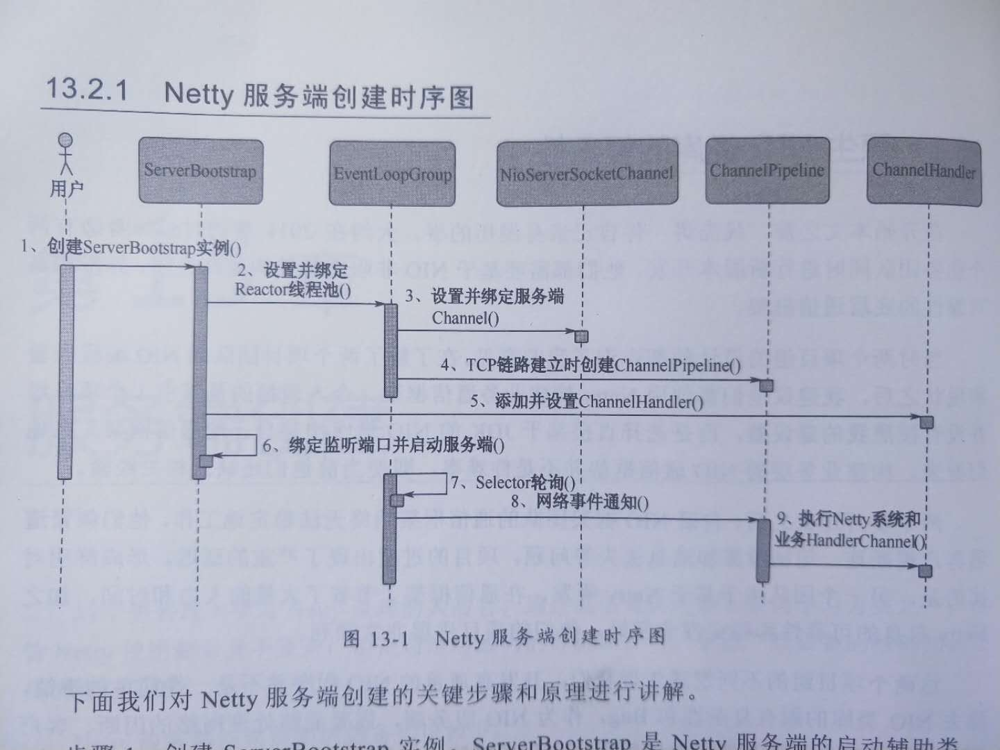

前提： 
>* 熟悉NIO使用
>* Java多线程编程
>* 了解Reactor模式
>* [无锁编程](https://blog.csdn.net/zzulp/article/details/6259866)

# 服务端创建
创建SerBootStrap实例，时序图如下：
  
>* ServerBootStrap是Netty服务端的启动辅助类，Builder模式
>* 设置绑定Reactor线程池，Netty的线程池是EventLoopGroup--EventLoop数组。EventLoop职责：处理所有注册到
本线程多路复用器Selector上的Channel，Selector的轮询操作由绑定的EventLoop线程run方法驱动，在一个循环体内循环执行。
EventLoop的职责：处理网络I/O；处理用户自定义task和定时任务task（避免启动其他线程用于异步执行另外的任务）
>* 设置绑定服务端channel 
>* TCP链路建立时候创建并初始化ChannelPipeline。一个负责处理网络事件的职责链,网络事件以事件流
的形式在ChannelPipline中流转，由ChannelPipeline根据网络事件的类型调度ChannelHandler的执行
>* 初始化ChannelPipeline后，添加并设置ChannelHandler。~是Netty提供给用户定制和扩展的关键接口
>* 绑定并监听端口
>* electorS轮询，由Reactor线程NioEventLoop负责调度和执行Selector轮询操作
>* 轮询到就绪channel后，由Reactor线程NioEventLoop执行ChannelPipeline的相应方法，最终调度并执行ChannelHandler:
>* 执行Netty系统Channelhandler和用户定制的ChannelHandler。

# 线程模型
Netty框架的主要线程就是I/O线程
## Netty的线程模型
### Reactor单线程模型
所有的IO操作都在同一个NIO线程上完成，NIO线程职责：
>* 作为NIO服务端，接收客户端的TCP连接
>* 作为NIO客户端，向服务端发起TCP连接
>* 读取通信对端的请求或者应答消息
>* 向通信对端发送消息或者应答消息

Reactor模式采用的异步非阻塞I/O，理论上一个线程可以独立处理所有I/O相关的操作，但是：
>* 一个线程同时处理大量的链路，性能上无法支撑，即便NIO线程的负荷达到100%，也无法满足海量消息的编码，解码，读取和发送。
>* NIO线程负载过重后，处理速度将变慢，这会导致大量客户端连接超时，超时再重发。。。
>* 可靠性问题，一个NIO线程出现故障，整个系统通信模型就会不可用

## Reactor多线程模型
一组NIO线程来处理I/O操作
>* 一个专门的NIO线程--Acceptor线程用于监听服务端，接收客户端的TCP连接
>* 一个NIO线程池(包含一个任务队列和N个可用的线程)处理网络IO的读写操作(编解码读取发送)
>* 一个NIO线程可以同时处理N条链路，但一个链路只对应一个NIO线程，防止发生并发问题

## 主从Reactor多线程模型
服务端用于接收客户端连接的不再是一个单独的NIO线程，而是一个独立的NIO线程池：Acceptor线程池接收TCP连接，处理后将新创建的SocketChannel
注册到I/O线程池(sub reactor线程池)的某个I/O线程上，它负责SocketChannel的读写和编码工作。

## Netty的线程模型
```text
//Netty服务端启动代码
//两个独立的Reactor线程池
EventLoopGroup bossGroup = new NioEventLoopGroup();  //用于接收客户端请求
EventLoopGroup workerGroup = new NioEventLoopGroup();  //用于处理I/O相关读写操作以及系统调用Task，定时任务Task
try {
  ServerBootstrap b = new ServerBootstrap();
  b.group(bossGroup, workerGroup)
  .channel(NioServerSocketChannel.class)
  .option(ChannelOption.SO_BLACKLOG, 100)
  .handler(new LogginHandler(LogLevel.INFO))
  .childHandler(new ChannelInitalizer<SocketChannel>(){
  })...
}
```

为了尽可能提升性能，Netty在很多地方进行了无锁化设计(I/O线程内部进行串行设计)，同时可以通过调整参数同时启动多个串行化的线程并行运行。
**设计原理**：
Netty的NioEventLoop读取到消息后，直接调用ChannelPipeline的fireChannelRead。只要用户不主动切换线程，一直都是NioEventLoop调用用户的Handler，期间不进行线程切换。