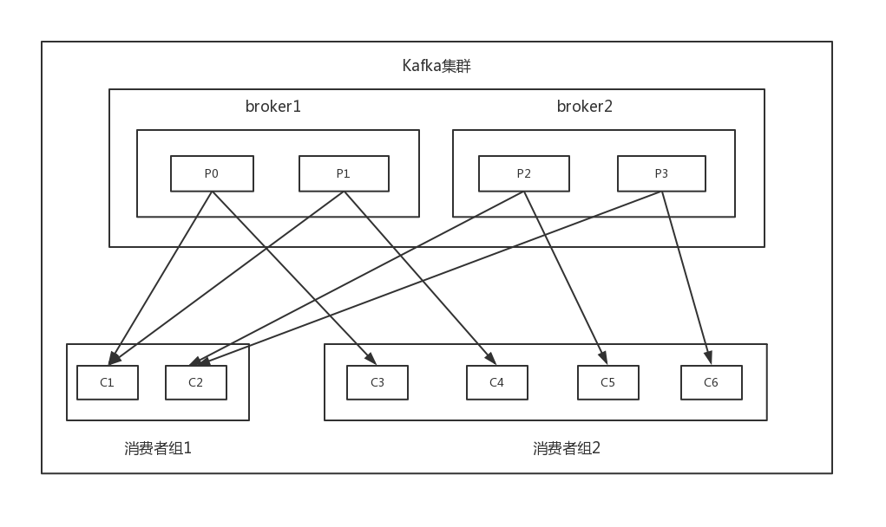

## consumer开发
### 基本概念
#### 消费者组(consumer group)
官方定义：**消费者使用一个消费者组名(group.id)来标记自己，topic的每条消息都只会被发送到每个订阅它的消费者组的一个消费者实例上。**    
Kafka同时支持基于队列和基于发布订阅的两种消息引擎模型，这是通过consumer group实现的：
>* 所有的consumer实例都属于相同group -- 实现基于队列的模型。每条消息只会被一个consumer实例处理。
>* 每个consumer实例属于不同group --实现基于发布/订阅的模型。

如下图所示,topic有四个分区，分布在两个broker上：

  
上图展示了consumer group订阅topic的整体结构(注意到一点：对于某个group而言，topic的每个分区只能分配给该group下的一个consumer实例)，可以看出Kafka在consumer group成员分配时可以做到公平的分配。   
**consumer group的好处是什么？**  
组内多个consumer实例可以同时读取Kafka消息，一旦有一个consumer挂了，consumer group会将已崩溃的conusmer所负责的分区转交给其他consumer来负责，从而保证整个group可以继续工作，不会出现数据丢失，这个过程叫做**重平衡(rebalance)机制**。   
此外，Kafka目前只提供单个分区内的消息顺序，不会维护全局的消息顺序，因此如果要实现topic全局的消息读取顺序，就只能通过让每个consumer group下只包含一个consumer实例的方式来间接实现。   
#### 位移(offset)
这里的offset指的是consumer端的offset，与分区日志中的offset不同。每个consumer实例都会为它消费的分区维护属于自己的位置信息来记录当前消费了多少条消息，即位移(offset)。    
Kafka consumer内部使用一个map来保存其订阅的topic所属分区的offset，同时引入了checkpoint机制定期对offset持久化。 
**思考** 如果在broker端维护offset，会有哪些弊端？(broker变成有状态的，增加同步成本；需要引入应答机制；要保存很多consumer的offset，需要设计复杂的数据结构，造成资源浪费)   
#### 位移提交
consumer客户端需要定期向Kafka集群汇报自己消费数据的进度，这个过程称为位移提交。consumer把位移提交到Kafka的一个内部topic(__consumer_offsets)上。   
__consumer_offsets是Kafka自行创建的，用户不可擅自删除该topic的所有信息。   
__consumer_offsets的消息格式可以理解为一个KV对，key就是一个三元组：group.id+topic+分区号，value就是offset的值。每当更新同一个key的最新offset值，该topic就会写入一条最新的offset的消息，
Kafka定期会对该topic执行压实操作，即每个消息只保存最新offset的消息(具体实现后文提及)。
#### consumer主要参数
除了必备的几个参数，consumer还提供了其他一些很重要的参数：
>* session.timeout.ms:  consumer group检查组内成员发送崩溃的时间，为了能尽可能地感知崩溃，需要将这个数值缩小，但是该参数还有一重含义：consumer消息处理的最大时间，
如果consumer两次poll之间的建个超过了这个参数设置的阈值，那么coordinator就会认为这个consumer以及跟不上其他成员的消费进度了，会将其踢出。为此，该参数在0.10.1.0之后
只表示coordinator检测失败的时间。
>* max.poll.internal.ms: consumer消息处理逻辑的最大时间。
>* auto.offset.reset: 指定了无位移消息或者位移越界时Kafka的应对策略。三种类型，分别是earliest、latest和none。
>* enable.auto.commit: consumer是否自动提交位移。
>* fetch.max.bytes: consumer端单词获取数据的最大字节数。
>* max.poll.records: 单次poll调用返回的最大消息数。 
>* hearbeat.interval.ms: 当coordinator决定开启新一轮rebalance时，它会将这个决定以“REBALANCE_IN_PROGRESS”异常的形式放入consumer心跳请求的response中，这样其他成员拿到response后
才知道它需要重新加入group(注意该参数要小于session.timeout.ms)。
>* connections.max.idle.ms: Kafka会定期关闭空闲Socket连接导致下次consumer处理请求时需要重新创建连向broker的Socket连接，参数默认设置为9分钟，如果不在乎这些Socket资源开销，可设置为-1，
即不关闭空闲连接。

### 构建consumer程序
一个常规的consumer端代码：
```text
String topic = "jinx_consumer";
String groupId = "jinx_01";
Properties props = new Properties();
props.put("bootstrap.servers", "l92.168.70.133:9092");
props.put("group.id", groupId);
props.put(ProducerConfig.KEY_SERIALIZER_CLASS_CONFIG, IntegerSerializer.class.getName());
props.put(ProducerConfig.VALUE_SERIALIZER_CLASS_CONFIG, StringSerializer.class.getName());
//加上其他的参数配置
KafkaConsumer<Integer, String> consumer = new KafkaConsumer<>(props);
consumer.subscribe(Arrays.asList(topic));
try {
  while(true) {
    // poll使用超时设置，通常情况，consumer拿到足够多的数据就立即从该方法返回，但如果当前没有足够多的数据可供返回，就会储于阻塞状态，这里最多阻塞1000毫秒。
    ConsumerRecords<String, String> records = consumer.poll(1000);
    for (ConsumerRecord<String, String> record: records) {
      ...
    }
  } finally {
        consumer.close();
    }
}
```
和Producer端代码很相似。   
上面代码中展示的topic订阅的基本方法：
```text
consumer.subscribe(Arrays.asList("topic1", "topic2"));
```
该方法还支持正则表达式
```text
consumer.subscribe(Pattern.compile("topic*"), new NoOpConsumerRebalanceListener());
```
第二个参数实现了ConsumerRebalanceListener接口，具体后面介绍。  
需要注意的是，subscribe方法不是增量式的，这意味着后续的subcribe调用将会覆盖前一个subcribe方法。

### 消息轮询
#### poll内部原理
类似于poll或select等，使用一个线程管理多个socket连接，即与多个broker通信实现消息的并行读取，从而能够读取多个topic的多个分区。    
一旦consumer订阅了topic，所有的消费逻辑包括coordinator的协调、消费者组的rebalance以及数据获取都在poll的一次调用中被执行。这样，用户就能很容易地使用一个线程来管理所有的consumer I/O操作。  
Java consumer是一个多线程或者说双线程的Java进程 -- 创建KafkaConsumer的线程被称为用户主线程(poll方法)，同时会创建一个心跳线程。   
总结poll的使用方法：
>* consumer需要定期执行其他子任务，推荐poll(较小超时时间)+运行标识布尔变量的方式
>* consumer不需要定期执行子任务，推荐poll(MAX_VALUE)+ 捕获WakeUpException
#### 位移管理
offset对于consumer非常重要，因为它是实现消息交付语义保证的基石。常见的3种消息交付语义如下：
>* 最多一次处理语义：消息可能丢失，但不会被重复处理(在消费之前就提交位移)。
>* 最少一次处理语义： 消息不会丢失，但可能被处理多次。
>* 精确一次处理语义： 消息一定被处理，且只会被处理一次。

consumer各种位置信息：
>*  上次提交的位移；
>*  当前位置；
>*  水位：分区日志中的概念，水位以下的所有消息，consumer都可以读取，水位以上的消息不能读取；
>*  日志终端位移（LEO）： 分区日志中的概念，标识某个分区副本当前保存消息对应的最大位移值(只有分区所有副本都保存了某条消息，该分区的leader副本才会向上移动水位值)。

consumer会在Kafka集群的所有broker中选择一个broker作为consumer group的coordinator，用于实现组成员管理，消息分配方案以及提交位移等。   
当consumer首次启动时，由于没有初始的位移信息，coordinator必须为其确定初始位移，通过**auto.offset.reset**配置。当consumer运行一段时间后，它必须提交自己的位移值。这部分对应上文提到的topic(__consumer_offset)：
**consumer提交位移通过向所属的coordinator发送位移提交请求来实现，每个位移提交请求会向__consumer_offsets对应分区上追加写入一条消息。**  
关于自动提交和手动提交：
Kafka默认自动提交位移，通过设置auto.commit.interval.ms参数可以控制自动提交的间隔。但是需要细粒度地提交位移时，就需要使用手动位移提交。  
现有需求，用户想要确保只有消息被真正处理完成(存入数据库)后再提交位移：
```text
...
List<ConsumerRecord<String, String>> buffer = new ArrayList<>();
while (true) {
  ConsumerRecords<String, String> records = consumer.poll(1000);
  for (ConsumerRecord<String, String> record: records) {
    buffer.add(record);
  }
  //
  if (buffer.size() >= minBatchSize) {
    insertIntoDb(buffer);
    consumer.commitSync(); # 异步非阻塞调用
    buffer.clear();
  }
}
```
### 重平衡(rebalance)
consumer group的rebalance本质上是一组协议，它规定了一个consumer group是如何达成一致来分配订阅topic的所有分区的。
rebalance触发条件：
>* 组成员变更
>* consumer group订阅的topic数发生变更
>* consumer group订阅的topic的分区数发生变更

#### rebalance分区分配
Kafka提供了三种策略： 
>* range: 基于范围设计，将单个topic的所有分区按照顺序排列，然后将这些分区分成固定大小的分区段并依次分配给每个consumer；
>* round-robin：将所有topic的所有分区按顺序排开，然后轮询地分配给每个consumer；
>* sticky： 避免了前两者无视历史分配方案的缺陷，规避了数据倾斜并在两次rebalance之间最大限度地维持了之前的分配方案。  

用户可以通过consumer参数**partition.assignment.strategy**来设置。另外kafka支持自定义的分配策略。   
#### rebalance generation 
Kafka引入rebalance generation用来标识某次rebalance(类似于JVM GC中的分代)主要是为了保护consumer group，特别是防止无效offset提交，比如一个延迟的offset提交携带的是旧的generation信息，
这次提交就会被consumer group拒绝。   
#### rebalance流程
Kafka提供了5个协议处理rebalance相关事宜：
>* JoinGroup请求：consumer请求加入组；
>* SyncGroup请求：[group leader](https://stackoverflow.com/questions/42015158/what-is-the-difference-in-kafka-between-a-consumer-group-coordinator-and-a-consu)把分区分配方案同步更新到组内所有成员上；
>* Heartbeat请求：consumer定期向coordinator汇报心跳表明自己依然存活；
>* LeaveGroup请求：consumer主动通知coordinator该consumer即将离组；
>* DescribeGroup请求：查看组内的所有信息，包括成员信息、协议信息、分配方案以及订阅信息等。该请求类型主要供管理员使用，coordinator不适用该请求执行rebalance。

consumer group在执行rebalance之前必须首先确定coordinator所在的broker，并创建与该broker相互通信的Socket连接。确定coordinator的算法与确定offset被提交到__consumer_offsets目标分区的算法是相同的。算法如下：
>* 计算Math.abs(groupId.hashCode) % offsets.topic.num.partitions参数值(默认是50),假设结果是10；
>* 寻找__consumer_offsets分区10的leader副本所在的broker，该broker即为这个group的coordinator。

成功连接coordinator之后便可以执行rebalance操作。rebalance主要分为两步：
>* 加入组：所有group.id相同的consumer实例向coordinator发送JoinGroup请求，当收集全JoinGroup请求后，coordinator从中选择一个consumer担任group的leader，并把所有的成员信息以及它们的订阅信息发送给leader。
>* 同步更新分配方案：leader指定分配方案，根据前面提到的rebalance分区分配策略决定每个consumer负责topic的哪些分区。一旦分配完成，leader会把这个分配方案封装进SyncGroup请求并发给coordinator(组内所有的成员都会发送SyncGroup请求，
但是只有leader的SyncGroup请求中包含了分配方案)，coordinator接收到分配方案后把属于每个consumer的方案单独抽取出来作为SyncGroup请求的response返回给各个consumer。
#### rebalance监听器
rebalance监听器有一个接口回调类ConsumerRebalanceListener，前文已有提及：
```text
public class ConsumerRebalanceListener {
    //在rebalance完成后被调用
    public void onPartitionsAssigned(Collection<TopicPartition> partitions);
    //在coordinator开启新一轮rebalance前被调用
    public void onPartitionsRevoked(Collection<TopicPartition> partitions);
}
```
rebalance监听器最常见的用法就是手动提交位移到第三方存储以及在rebalance前后执行一些必要的审计操作。  
下面这个例子演示如何使用rebalance监听器来向数据库提交位移并且统计group总的rebalance时间：
```text
final AtomicLong totalRebalanceTimeMs = new AtomicLong(0L);
        final AtomicLong joinStart = new AtomicLong(0L);
        consumer.subscribe(Arrays.asList(this.topic), new ConsumerRebalanceListener() {
            @Override
            public void onPartitionsRevoked(Collection<TopicPartition> partitions) {
                for(TopicPartition tp: partitions) {
                    //将分区offset保存到外部存储：saveToExternal(consumer.position(tp))
                }
                joinStart.set(System.currentTimeMillis());
            }

            @Override
            public void onPartitionsAssigned(Collection<TopicPartition> partitions) {
                //更新总的rebalance时长
                totalRebalanceTimeMs.addAndGet(System.currentTimeMillis() - joinStart.get());
                for (TopicPartition tp: partitions) {
                    /*
                    从外部存储中读取该分区offset,seek方法会将consumer当前位移指定到读取的位移处并从该位移处开始读取信息
                    consumer.seek(tp, readFromExteanal(tp));
                     */
                    
                }
            }
        });
```
### 多线程消费实例
#### 每个线程维护一个KafkaConsumer
[见](https://github.com/suns1824/Jinx/tree/master/src/main/java/com/raysurf/test/kafka/example/consumer/a)
#### 单KafkaConsumer实例+多worker线程
[见](https://github.com/suns1824/Jinx/tree/master/src/main/java/com/raysurf/test/kafka/example/consumer/b)   
两者的比较：   

|         | 优势   |  劣势  |
| --------   | -----:  | :----:  |
| 每个线程维护一个KafkaConsumer实例     | 实现简单，无线程间交互开销；方便位移管理，易于维护分区间的消息消费顺序 |   socket连接开销大，consumer数量受限于topic分区数，扩展性差；broker端负载大(请求数增加)；rebalance可能性增大   |
| 一个/多个kafkaConsumer+多个worker线程   | 消息获取和处理解耦，扩展性好   | 难于维护分区内的消息顺序；处理链路增加，导致位移管理困难；worker线程异常可能导致消费数据丢失。   |
