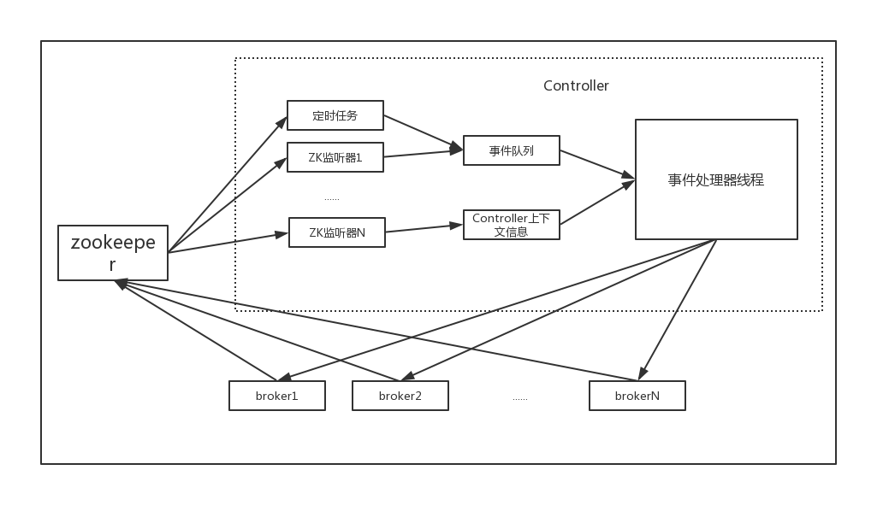

//接下来部分不会很系统，慢慢积累，先大体过一遍。
## Kafka设计原理
### broker端设计架构
#### 消息设计
即使JMM做了类的字段的重排，但依旧会有不必要的内存空间浪费，并且随着堆上数据越来越多，GC性能也会下降。所以Kafka使用**Java NIO的ByteBuffer**来保存消息，同时依赖文件系统提供的**页缓存机制**，而不是Java的堆缓存。因为大多数情况下，
我们在堆上保存的对象在写入文件系统后很可能在操作系统的页缓存中仍保存着，造成资源浪费。另外，ByteBuffer使用的是紧凑的二进制字节结构，不需要padding操作。
#### 集群管理
1. 成员管理
Kafka是一个分布式消息引擎集群环境，它支持自动化的服务发现和成员管理。它是通过依赖Zookeeper实现的。每当一个broker启动时，它会将自己注册到Zookeeper下的一个节点(临时节点)，这个临时节点的生命周期和客户端会话绑定。
同时还会创建一个监听器监听该临时节点的状态。一旦broker启动后，监听器会自动同步整个集群信息到该broker上；一旦该broker崩溃，那么这个临时节点就会被删除，监听器触发处理相关事宜。  
#### 副本和ISR设计
todo
#### controller设计
在一个Kafka集群中，某个broker会被**选举**出来管理和协调Kafka集群中的分区状态并执行相应的管理操作。每个Kafka集群任意时刻都只能有一个controller。controller架构如下所示：

 

controller维护的状态分为两类：
>* 每台broker的分区副本
>* 每个分区的leader副本信息   

从维度上讲分为副本状态和分区状态(集群下所有分区的状态管理)，Kafka引入了两个状态机管理这两种状态：
>* 副本状态机
#### 通信协议
todo
#### 日志存储设计
todo
>* 分区状态机
状态机提供了一些状态并设定了创建topic后每个分区的副本状态和所有分区的状态的流转规则。   
#### broker请求处理
Kafka broker处理请求的模式是Reactor模式。每个broker都有一个acceptor线程和若干个processor线程(可以通过**num.network.threads**来控制processor线程的数量)。processor线程实际上也不是处理请求的真正执行者，Kafka创建了一个
KafkaRequestHandler线程池专门地处理真正的请求。processor线程的任务就是将Socket连接上收到的请求放入请求队列中(Reactor模型基于NIO设计，每个processor线程中维护一个Selector实例，通过这个这个Selector来管理多个通道上的数据交互)。
每个broker启动时会创建一个全局唯一的请求队列(阻塞队列)，大小由**queued.max.requests**设置。   
  
### producer端设计架构
todo
### consumer端设计架构
todo
### 实现精确一次处理语义 
Kafka通过引入幂等性producer和事务来实现EOS。
#### 幂等性producer
设计思路类似于TCP工作方式，发送到broker端的每批消息被赋予一个序列号用于消息去重。但是和TCP不同的是，这个序列号不会被丢弃，相反Kafka会把它们保存在底层日志中，这样即使分区的leader副本挂掉，新选出来的leader broker
也能执行消息去重工作。除了序列号，Kafka还会为每个producer实例分配一个producer id(简称位PID)。消息要被发送到的每个分区都有对应的序列号值，它们总是从0开始并严格单调递增。设想一个这样的map，
key为(PID, 分区号)，value为序列号，如果发送消息的序列号小于或等于broker端保存的序列号，那么broker会拒绝这条消息的写入操作。  
ps：由于每个新的producer实例都会被分配不同的PID，所以这个设计只能保证在单个producer实例的EOS语义。
#### 事务
引入事务使得clients端程序能够将一组消息放入一个原子性单元中统一处理。

