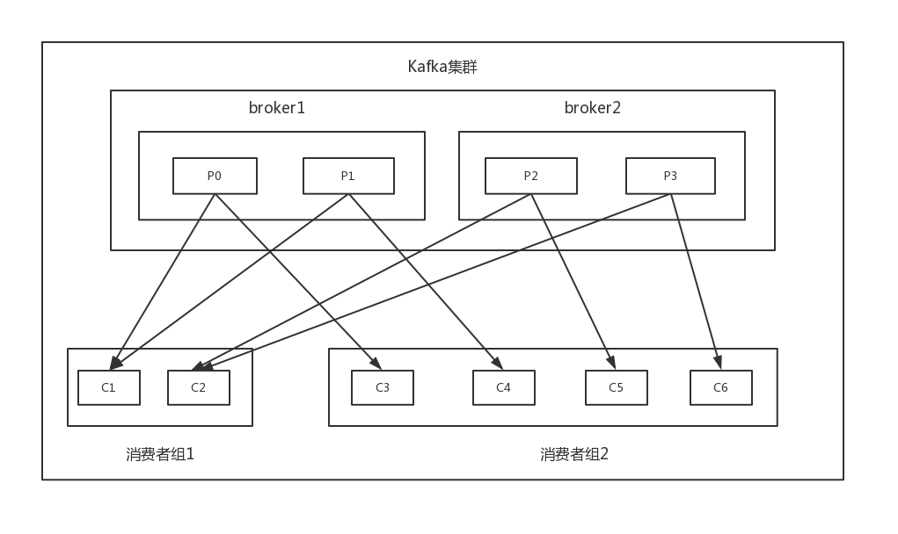

本文是Apache Kafka实战的学习笔记
## 认识Kafka
### 操作
>* 启动zk
>* 启动kafka(在每个节点执行)kafka-server-start.sh  -daemon config/server.properties &
>* 创建topic：kafka-topic.sh --create --topic jinx01 --partitions 1 --replication-factor 2 --zookeeper hd1:2181,hd2:2181(这个写一个运行状态的zk节点即可)
>* 查看所有的topic: kafka-topic.sh --list --zookeeper hd1:2181,hd2:2181
>* 查看某一topic状态：kafka-topic.sh --describe --zookeeper hd1:2181,hd2:2181 --topic jinx01
>* 发送消息：kafka-console-producer.sh --broker-list hd1:9092 --topic jinx01  
   haha  
   hehe  
   eeee  
>* 消费消息：kafka-console.consumer.sh --topic jinx01 --zookeeper hd1:2181

### 消息引擎系统
>* 消息设计：SOAP协议采用XML，Web Service支持Json，Kakfa是二进制方式保存的。
>* 传输协议设计：自己设计了一套二进制消息传输协议
>* 消息引擎范型： 消息队列模型和发布订阅模型，kafka通过consumer group同时支持这两种模型。

### **基本概念和术语**
kafka是一个消息引擎系统，也是一个流数据处理平台。  
>* 消息：由消息头、key、value组成。Kafka使用ByteBuffer(二进制字节数组)而不是独立对象，从而避免了堆上分配内存，节省了内存空间，同时页缓存的好处还有：broker崩溃时，
堆内存数据消失，但是页缓存还在。
>* topic和partition：kafka采用topic-partition-message的三级结构来分散负载。partition内的每条消息都有一个递增的序列号(offset)。消费者端也有offset概念，指的是消费的进度。
>* replica： 就是分区的副本，包括leader replica和follower replica，后者不提供服务只是被动地向前者获取数据，当前者所在broker宕机，就会从剩余的replica中选取新的leader。
kafka保证一个partition的多个replica不会分配在同一个broker上。
>* ISR: 与leader replica保持同步的replica集合，进度滞后到一定程度的replica将会被踢出ISR。只有该集合内所有replica都接受到了同一条消息，Kafka才会将该消息置于已提交状态(发送成功)。

### **kafka概要设计**
####吞吐量/延时
如果采用批处理思想，吞吐量大增但是延时就高，需要权衡。  
Kafka如何做到高吞吐量和低延时？  
Kafka写入(通过追加方式)很快，因为并没有直接将数据持久化到磁盘，而是先把数据写入到操作系统的页缓存中，然后由操作系统决定何时写回磁盘。   、
读取首先尝试从OS的页缓存上读取，命中遍把消息经页缓存直接发送到网络socket上。使用Linux的sendfile系统调用，基于[零拷贝技术](https://www.jianshu.com/p/fad3339e3448)。  
总结，Kafka如何实现高吞吐量和低延迟：
>* 大量使用页缓存
>* 操作系统完成物理I/O
>* 追加写入方式
>* sendfile零拷贝技术  

#### 消息持久化
消息持久化到磁盘的好处有两点：
>* 解耦了生产者和消费者
>* 可以方便kafka下游系统对消息进行处理

#### 负载均衡和故障转移
通过领导者选举实现负载均衡，均匀分散各个partition的leader；   
会话机制通过zk来检测节点失效。  

#### 伸缩性  
线性扩容的阻碍之一就是状态的保存，通过zk来保存管理系统的状态。

## producer开发

#### 构造Producer对象
```text
public Producer(String topic, Boolean isAsync) {
        Properties props = new Properties();
        //必须指定，该参数指定了一组host:port对，创建向kafka服务器的连接，比如k1:9092,k2:9092,k3:9092
        props.put(ProducerConfig.BOOTSTRAP_SERVERS_CONFIG, KafkaProperties.KAFKA_SERVER_URL + ":" + KafkaProperties.KAFKA_SERVER_PORT);
        props.put(ProducerConfig.CLIENT_ID_CONFIG, "DemoProducer");
        //下面两个参数都必须指定，这两个参数指定了实现了org.apache.kafka.common.serialization.server接口的类的全限定名，Kafka为大多数的初始类型默认提供了现成的序列化器。
        props.put(ProducerConfig.KEY_SERIALIZER_CLASS_CONFIG, IntegerSerializer.class.getName());
        props.put(ProducerConfig.VALUE_SERIALIZER_CLASS_CONFIG, StringSerializer.class.getName());
        producer = new KafkaProducer<>(props);
        this.topic = topic;
        this.isAsync = isAsync;
}
//调用，两种方式，同步和异步，Kafka底层完全实现了异步化发送，当时通过Java的Future接口实现了API层级的同步和异步发送方式
if (isAsync) { // Send asynchronously，DemoCallBack实现了CallBack接口
                producer.send(new ProducerRecord<>(topic,
                    messageNo,
                    messageStr), new DemoCallBack(startTime, messageNo, messageStr));
            } else { // Send synchronously，通过Future.get无限等待结果返回，实现同步发送的效果
                try {
                    producer.send(new ProducerRecord<>(topic,
                        messageNo,
                        messageStr)).get();
                    System.out.println("Sent message: (" + messageNo + ", " + messageStr + ")");
                } catch (InterruptedException | ExecutionException e) {
                    e.printStackTrace();
                }
            }
            
//producer一定要关闭
producer.close();
```
producer主要参数(除了上文提及)：
>* **acks**: 用于控制producer生产消息的持久性。当一条消息被发送到kafka集群时，这条消息会被发送到指定topic分区leader所在的broker上，producer等待从该leader broker返回消息的写入结果确保消息被成功提交。这之后producer可以
继续发送下一条。leader broker何时发送写入结果返还给producer直接影响消息的持久性甚至是producer端的吞吐量：producer端越快接收到leader broker的相应就能越快发送下一条消息，吞吐量就越大。  
acks指定了在给producer发送响应前，leader broker必须要确保已成功写入该消息的副本数。acks有三个取值：0，1，all：0表示producer无需理睬leader broker的处理结果；all/-1表示leader broker只有在将消息写入本地日志还会等待ISR中
其他所有副本都写入各自的本地日志后，才会发送响应结果给producer；1表示XXX。
>* **buffer.memory**: 该参数指定了producer端用于缓存消息的缓冲区大小，单位是字节(默认为32MB)。producer启动时会创建一个内存缓冲区用于保存待发送的消息，由另一个专属线程负责从缓冲区读消息执行真正的发送（如果写入缓冲区的速度超过
了读取消息并发送的速度，就会XXX）。该参数的大小可以近乎认定为producer程序使用的内存大小，过小的内存缓冲区会降低producer程序的吞吐量。
>* **compression.type**： 指定producer端消息的压缩类型，可以降低网络I/O传输开销，但也会增加prodducer端的CPU开销。如果broker端的压缩参数设置得和producer不同，broker端在写入消息时也会额外使用CPU资源对消息进行解压缩-重压缩操作。
目前Kafka支持3种压缩算法：GZIP、Snappy、LZ4(实际使用经验来看LZ4性能最好)。
>* **retries**: 该参数指定了producer端发送消息的重试次数，超过这个次数后，broker端才会将这些错误封装进回调函数的异常中。在考虑retries的参数设置时，需要考虑两点：     
    1) 如果瞬时的网络抖动使得broker已成功写入消息但没有成功发送消息给producer，因此producer会认为消息发送失败，从而重试。为此，consumer端需要执行去重处理，不过kafka从0.11.0.0已经支持“精确一次”处理语义，从设计上避免了该类问题。    
    2) 重试可能造成乱序，Kafka默认将5个消息发送请求缓存在内存中，消息重试可能会导致消息流乱序，可以将**max.in.flight.requests.per.connection**参数设置为1，确保同一时刻只能发送一个请求。    
    另外，producer两次重试之间会停顿一段时间，以防止频繁重试对系统带来冲击，该时间是可配置的，由参数**retry.backoff.ms**指定，默认为100ms，推荐通过测试平均的leader选举时间(最常见的错误是leader选举导致)并根据该时间来设置该参数。   
>* **batch.size**: 该参数对于调优producer吞吐量和延时性能指标都有着重要的作用，producer会将发往同一分区的多条消息封装进一个batch中。当batch满的时候，producer返回发送batch中所有的消息。当然很可能batch还有很多空间时producer就发送该batch。
batch过小，一次发送请求能够写入的消息很少，producer吞吐量就会很低；如果很大，那么内存压力就大，延迟也会高。
>* **linger.ms**: 该参数控制消息发送延时行为，默认为0，表示消息立即被发送，无需关心batch是否填满。但是这样会拉低producer的吞吐量，因为producer发送的每次请求中包含的消息越多，producer就越能将发送请求的开销分摊到更多的消息上，
从而提高吞吐量。   
>* **max.request.size**:该参数用于控制producer端发送请求的大小，即能够发送的最大消息大小。
>* **request.timeout.ms**: producer发送请求给broker后，broker需要在规定的时间范围内将处理结果返还给producer，该参数控制了该时间，默认为30s。

#### 消息分区机制
Kafka Producer发送消息时需要确认将消息发送到topic的那个partition中去，producer提供了分区策略和对应的分区器(partitioner)提供给用户。默认partitioner会尽可能地保证相同key的消息会被发送到相同的分区中。如果没有为消息指定key，那么partitioner
会采用轮询的方式来确保消息在topic的所有分区上均匀分配。   
ps: 对于有key的消息，Java版本的producer采用了murmur2算法计算key的hash值，然后对总分区取模得到消息将要被发送的分区号。用户也可以自己实现分区策略：
```text
@Override
    public int partition(String topic, Object key, byte[] keyBytes, Object value, byte[] valueBytes, Cluster cluster) {
        ......
        return 0;
    }

    @Override
    public void close() {
    //资源关闭
    }

    @Override
    public void configure(Map<String, ?> configs) {
       //configure方法实现了Configurable接口，这里进行资源的初始化工作
    }

然后在KafkaProducer的Properties对象中指定partitioner.class参数：
properties.put("partitioner.class", "com.raysurf.xxx.RaysurfPartitioner");
```
#### 消息序列化
Kafka为基本的数据类型提供了序列化实现，复杂类型一般需要自定义序列化：
```text
@Data
public class User {
  private String name;
  private int age;
  private int sex;
}
public class UserSerializer implements Serializer {
    private ObjectMapper mapper;
    @Override
    public void configure(Map configs, boolean isKey) {
        mapper = new ObjectMapper();
    }

    @Override
    public byte[] serialize(String topic, Object data) {
        byte[] ret = null;
        try {
            ret = mapper.writeValueAsString(data).getBytes("utf-8");
        } catch (UnsupportedEncodingException e) {
            e.printStackTrace();
        } catch (JsonProcessingException e) {
            e.printStackTrace();
        }
        return ret;
    }

    @Override
    public void close() {

    }
}
```

#### producer拦截器
对于producer而言，interceptor使得用户在消息发送之前以及producer回调逻辑前有机会对消息做一些定制化的需求，比如修改消息等。同时producer允许用户指定多个interceptor按序作用于同一条消息从而形成一个拦截链。
举例说明：  
实现一个双interceptor组成的拦截链。第一个interceptor在消息发送前将时间戳信息加到消息的value的最前部；第二个interceptor会在消息发送后更新成功消息数或失败发送消息数。   
interceptor1:   
```text
public class TimeStampPrependerInterceptor implements ProducerInterceptor<String, String> {
    /*
    这个方法在KafkaProducer.send中被使用到，表明其运行在主线程中。producer确保在消息被序列化之前调用该方法，用户可以在这里对消息做任何操作，但最好不要
    修改消息所属的topic和分区有关的信息，否则会影响目标分区的计算。
     */
    @Override
    public ProducerRecord<String, String> onSend(ProducerRecord<String, String> record) {
        //将时间戳信息加到消息value的最前部
        return new ProducerRecord(record.topic(), record.partition(), record.timestamp(), record.key(), System.currentTimeMillis() + "," + record.value().toString());
    }
    /*
    该方法运行在producer的I/O线程，在消息被应答之前或者消息发送失败时调用。
     */
    @Override
    public void onAcknowledgement(RecordMetadata metadata, Exception exception) {...}
    //关闭interceptor,做资源清理相关工作
    @Override
    public void close() {...}
    //实现Configurable接口
    @Override
    public void configure(Map<String, ?> configs) {...}
}
```
interceptor2:  
```text
public class CounterInterceptor implements ProducerInterceptor<String, String> {
    private int successCount = 0;
    private int failCount = 0;
    @Override
    public ProducerRecord<String, String> onSend(ProducerRecord<String, String> record) {
        return record;
    }
    @Override
    public void onAcknowledgement(RecordMetadata metadata, Exception exception) {
        if (exception == null) {
            successCount ++;
        } else {
            failCount ++;
        }
    }
    @Override
    public void close() {
        System.out.println("success count: " + successCount);
        System.out.println("fail count: " + failCount);
    }
    @Override
    public void configure(Map<String, ?> configs) {...}
}
```

在构造KafkaProducer的代码中添加如下：
```text
        List<String> interceptors = new ArrayList<>();
        interceptors.add("com.raysurf.test.kafka.example.interceptor.TimeStampPrependInterceptro");
        interceptors.add("com.raysurf.test.kafka.example.interceptor.CounterInterceptor");
        props.put(ProducerConfig.INTERCEPTOR_CLASSES_CONFIG, interceptors);
```

#### 无消息丢失配置
**Kafka的producer采用异步发送机制，KafkaProducer.send方法仅仅将消息放入缓冲区内，然后有一个I/O线程从缓冲区提取消息并封装进消息batch，然后
发送出去**。如果I/O线程发送之前producer崩溃，那么存储缓冲区中的消息就会全部丢失。另外，如果由于瞬时的网络抖动，Kafka进行消息发送的重试，则可能会出现乱序。   
对于这个问题，最粗暴的方法是采用同步的方法：producer.send(record).get()，但性能可能会受到较大影响。可以通过如下配置，实现producer端的无消息丢失：
```text
//producer端配置
block.on.buffer.full=true  //内存缓冲区满时producer阻塞并停止接收消息而不是抛出异常，0.10.0.0后不用理会该参数，设置max.block.ms(超出这个时间再报异常)即可
acks=all or -1
retries=Integer.MAX_VALUE
max.in.flight.requests.per.connection=1

使用KafkaProducer.send(record, callback)
callback中显示地立即关闭producer，使用close(0)

//broker端配置
unclean.leader.election.enable=false  //关闭unclean leader选举，不允许非ISR中的副本被选举为leader，从而避免broker端因日志水位截断而造成的消息丢失
replication.factor=3   //>=3个备份
min.insync.replicas=2  //至少被写入到ISR中的多少个副本才算成功  
确保replication.factor>min.insync.replicas
enable.auto.commit=false
```
#### 多线程处理
>* 多线程单KafkaProducer实例（因为KafkaProducer是线程安全的）
>* 多线程多KafkaProducer实例     
对比：  

|         | 优势   |  劣势  |
| --------   | -----:  | :----:  |
| 多线程单KafkaProducer实例     | 实现简单，性能好 |   所有线程共享一个内存缓冲区，可能需要较多内存；一个线程崩溃，整个实例被破坏     |
| 多线程多KafkaProducer实例        |   可以细粒度调优(每个线程拥有KafkaProducer实例)，单个KafkaProducer崩溃不会影响其他   |   需要较大的内存开销   |

## consumer开发
### 基本概念
#### 消费者组(consumer group)
官方定义：**消费者使用一个消费者组名(group.id)来标记自己，topic的每条消息都只会被发送到每个订阅它的消费者组的一个消费者实例上。**    
Kafka同时支持基于队列和基于发布订阅的两种消息引擎模型，这是通过consumer group实现的：
>* 所有的consumer实例都属于相同group -- 实现基于队列的模型。每条消息只会被一个consumer实例处理。
>* 每个consumer实例属于不同group --实现基于发布/订阅的模型。

如下图所示,topic有四个分区，分布在两个broker上：

  
上图展示了consumer group订阅topic的整体结构(注意到一点：对于某个group而言，topic的每个分区只能分配给该group下的一个consumer实例)，可以看出Kafka在consumer group成员分配时可以做到公平的分配。   
**consumer group的好处是什么？**  
组内多个consumer实例可以同时读取Kafka消息，一旦有一个consumer挂了，consumer group会将已崩溃的conusmer所负责的分区转交给其他consumer来负责，从而保证整个group可以继续工作，不会出现数据丢失，这个过程叫做**重平衡(rebalance)机制**。   
此外，Kafka目前只提供单个分区内的消息顺序，不会维护全局的消息顺序，因此如果要实现topic全局的消息读取顺序，就只能通过让每个consumer group下只包含一个consumer实例的方式来间接实现。   
#### 位移(offset)
这里的offset指的是consumer端的offset，与分区日志中的offset不同。每个consumer实例都会为它消费的分区维护属于自己的位置信息来记录当前消费了多少条消息，即位移(offset)。    
Kafka consumer内部使用一个map来保存其订阅的topic所属分区的offset，同时引入了checkpoint机制定期对offset持久化。 
**思考** 如果在broker端维护offset，会有哪些弊端？(broker变成有状态的，增加同步成本；需要引入应答机制；要保存很多consumer的offset，需要设计复杂的数据结构，造成资源浪费)   
#### 位移提交
consumer客户端需要定期向Kafka集群汇报自己消费数据的进度，这个过程称为位移提交。consumer把位移提交到Kafka的一个内部topic(__consumer_offsets)上。   
__consumer_offsets是Kafka自行创建的，用户不可擅自删除该topic的所有信息。   
__consumer_offsets的消息格式可以理解为一个KV对，key就是一个三元组：group.id+topic+分区号，value就是offset的值。每当更新同一个key的最新offset值，该topic就会写入一条最新的offset的消息，
Kafka定期会对该topic执行压实操作，即每个消息只保存最新offset的消息(具体实现后文提及)。
#### consumer主要参数
除了必备的几个参数，consumer还提供了其他一些很重要的参数：
>* session.timeout.ms:  consumer group检查组内成员发送崩溃的时间，为了能尽可能地感知崩溃，需要将这个数值缩小，但是该参数还有一重含义：consumer消息处理的最大时间，
如果consumer两次poll之间的建个超过了这个参数设置的阈值，那么coordinator就会认为这个consumer以及跟不上其他成员的消费进度了，会将其踢出。为此，该参数在0.10.1.0之后
只表示coordinator检测失败的时间。
>* max.poll.internal.ms: consumer消息处理逻辑的最大时间。
>* auto.offset.reset: 指定了无位移消息或者位移越界时Kafka的应对策略。三种类型，分别是earliest、latest和none。
>* enable.auto.commit: consumer是否自动提交位移。
>* fetch.max.bytes: consumer端单词获取数据的最大字节数。
>* max.poll.records: 单次poll调用返回的最大消息数。 
>* hearbeat.interval.ms: 当coordinator决定开启新一轮rebalance时，它会将这个决定以“REBALANCE_IN_PROGRESS”异常的形式放入consumer心跳请求的response中，这样其他成员拿到response后
才知道它需要重新加入group(注意该参数要小于session.timeout.ms)。
>* connections.max.idle.ms: Kafka会定期关闭空闲Socket连接导致下次consumer处理请求时需要重新创建连向broker的Socket连接，参数默认设置为9分钟，如果不在乎这些Socket资源开销，可设置为-1，
即不关闭空闲连接。

### 构建consumer程序
一个常规的consumer端代码：
```text
String topic = "jinx_consumer";
String groupId = "jinx_01";
Properties props = new Properties();
props.put("bootstrap.servers", "l92.168.70.133:9092");
props.put("group.id", groupId);
props.put(ProducerConfig.KEY_SERIALIZER_CLASS_CONFIG, IntegerSerializer.class.getName());
props.put(ProducerConfig.VALUE_SERIALIZER_CLASS_CONFIG, StringSerializer.class.getName());
//加上其他的参数配置
KafkaConsumer<Integer, String> consumer = new KafkaConsumer<>(props);
consumer.subscribe(Arrays.asList(topic));
try {
  while(true) {
    // poll使用超时设置，通常情况，consumer拿到足够多的数据就立即从该方法返回，但如果当前没有足够多的数据可供返回，就会储于阻塞状态，这里最多阻塞1000毫秒。
    ConsumerRecords<String, String> records = consumer.poll(1000);
    for (ConsumerRecord<String, String> record: records) {
      ...
    }
  } finally {
        consumer.close();
    }
}
```
和Producer端代码很相似。   
上面代码中展示的topic订阅的基本方法：
```text
consumer.subscribe(Arrays.asList("topic1", "topic2"));
```
该方法还支持正则表达式
```text
consumer.subscribe(Pattern.compile("topic*"), new NoOpConsumerRebalanceListener());
```
第二个参数实现了ConsumerRebalanceListener接口，具体后面介绍。  
需要注意的是，subscribe方法不是增量式的，这意味着后续的subcribe调用将会覆盖前一个subcribe方法。

### 消息轮询
#### poll内部原理
类似于poll或select等，使用一个线程管理多个socket连接，即与多个broker通信实现消息的并行读取，从而能够读取多个topic的多个分区。    
一旦consumer订阅了topic，所有的消费逻辑包括coordinator的协调、消费者组的rebalance以及数据获取都在poll的一次调用中被执行。这样，用户就能很容易地使用一个线程来管理所有的consumer I/O操作。  
Java consumer是一个多线程或者说双线程的Java进程 -- 创建KafkaConsumer的线程被称为用户主线程(poll方法)，同时会创建一个心跳线程。   
总结poll的使用方法：
>* consumer需要定期执行其他子任务，推荐poll(较小超时时间)+运行标识布尔变量的方式
>* consumer不需要定期执行子任务，推荐poll(MAX_VALUE)+ 捕获WakeUpException
#### 位移管理
offset对于consumer非常重要，因为它是实现消息交付语义保证的基石。常见的3种消息交付语义如下：
>* 最多一次处理语义：消息可能丢失，但不会被重复处理(在消费之前就提交位移)。
>* 最少一次处理语义： 消息不会丢失，但可能被处理多次。
>* 精确一次处理语义： 消息一定被处理，且只会被处理一次。

consumer各种位置信息：
>*  上次提交的位移；
>*  当前位置；
>*  水位：分区日志中的概念，水位以下的所有消息，consumer都可以读取，水位以上的消息不能读取；
>*  日志终端位移（LEO）： 分区日志中的概念，标识某个分区副本当前保存消息对应的最大位移值(只有分区所有副本都保存了某条消息，该分区的leader副本才会向上移动水位值)。

consumer会在Kafka集群的所有broker中选择一个broker作为consumer group的coordinator，用于实现组成员管理，消息分配方案以及提交位移等。   
当consumer首次启动时，由于没有初始的位移信息，coordinator必须为其确定初始位移，通过**auto.offset.reset**配置。当consumer运行一段时间后，它必须提交自己的位移值。这部分对应上文提到的topic(__consumer_offset)：
**consumer提交位移通过向所属的coordinator发送位移提交请求来实现，每个位移提交请求会向__consumer_offsets对应分区上追加写入一条消息。**  
关于自动提交和手动提交：
Kafka默认自动提交位移，通过设置auto.commit.interval.ms参数可以控制自动提交的间隔。但是需要细粒度地提交位移时，就需要使用手动位移提交。  
现有需求，用户想要确保只有消息被真正处理完成(存入数据库)后再提交位移：
```text
...
List<ConsumerRecord<String, String>> buffer = new ArrayList<>();
while (true) {
  ConsumerRecords<String, String> records = consumer.poll(1000);
  for (ConsumerRecord<String, String> record: records) {
    buffer.add(record);
  }
  //
  if (buffer.size() >= minBatchSize) {
    insertIntoDb(buffer);
    consumer.commitSync(); # 异步非阻塞调用
    buffer.clear();
  }
}
```
### 重平衡(rebalance)
consumer group的rebalance本质上是一组协议，它规定了一个consumer group是如何达成一致来分配订阅topic的所有分区的。
rebalance触发条件：
>* 组成员变更
>* consumer group订阅的topic数发生变更
>* consumer group订阅的topic的分区数发生变更

#### rebalance分区分配
Kafka提供了三种策略： 
>* range: 基于范围设计，将单个topic的所有分区按照顺序排列，然后将这些分区分成固定大小的分区段并依次分配给每个consumer；
>* round-robin：将所有topic的所有分区按顺序排开，然后轮询地分配给每个consumer；
>* sticky： 避免了前两者无视历史分配方案的缺陷，规避了数据倾斜并在两次rebalance之间最大限度地维持了之前的分配方案。  

用户可以通过consumer参数**partition.assignment.strategy**来设置。另外kafka支持自定义的分配策略。   
#### rebalance generation 
Kafka引入rebalance generation用来标识某次rebalance(类似于JVM GC中的分代)主要是为了保护consumer group，特别是防止无效offset提交，比如一个延迟的offset提交携带的是旧的generation信息，
这次提交就会被consumer group拒绝。   
#### rebalance流程
Kafka提供了5个协议处理rebalance相关事宜：
>* JoinGroup请求：consumer请求加入组；
>* SyncGroup请求：[group leader](https://stackoverflow.com/questions/42015158/what-is-the-difference-in-kafka-between-a-consumer-group-coordinator-and-a-consu)把分区分配方案同步更新到组内所有成员上；
>* Heartbeat请求：consumer定期向coordinator汇报心跳表明自己依然存活；
>* LeaveGroup请求：consumer主动通知coordinator该consumer即将离组；
>* DescribeGroup请求：查看组内的所有信息，包括成员信息、协议信息、分配方案以及订阅信息等。该请求类型主要供管理员使用，coordinator不适用该请求执行rebalance。

consumer group在执行rebalance之前必须首先确定coordinator所在的broker，并创建与该broker相互通信的Socket连接。确定coordinator的算法与确定offset被提交到__consumer_offsets目标分区的算法是相同的。算法如下：
>* 计算Math.abs(groupId.hashCode) % offsets.topic.num.partitions参数值(默认是50),假设结果是10；
>* 寻找__consumer_offsets分区10的leader副本所在的broker，该broker即为这个group的coordinator。

成功连接coordinator之后便可以执行rebalance操作。rebalance主要分为两步：
>* 加入组：所有group.id相同的consumer实例向coordinator发送JoinGroup请求，当收集全JoinGroup请求后，coordinator从中选择一个consumer担任group的leader，并把所有的成员信息以及它们的订阅信息发送给leader。
>* 同步更新分配方案：leader指定分配方案，根据前面提到的rebalance分区分配策略决定每个consumer负责topic的哪些分区。一旦分配完成，leader会把这个分配方案封装进SyncGroup请求并发给coordinator(组内所有的成员都会发送SyncGroup请求，
但是只有leader的SyncGroup请求中包含了分配方案)，coordinator接收到分配方案后把属于每个consumer的方案单独抽取出来作为SyncGroup请求的response返回给各个consumer。
#### rebalance监听器
rebalance监听器有一个接口回调类ConsumerRebalanceListener，前文已有提及：
```text
public class ConsumerRebalanceListener {
    //在rebalance完成后被调用
    public void onPartitionsAssigned(Collection<TopicPartition> partitions);
    //在coordinator开启新一轮rebalance前被调用
    public void onPartitionsRevoked(Collection<TopicPartition> partitions);
}
```
rebalance监听器最常见的用法就是手动提交位移到第三方存储以及在rebalance前后执行一些必要的审计操作。  
下面这个例子演示如何使用rebalance监听器来向数据库提交位移并且统计group总的rebalance时间：
```text
final AtomicLong totalRebalanceTimeMs = new AtomicLong(0L);
        final AtomicLong joinStart = new AtomicLong(0L);
        consumer.subscribe(Arrays.asList(this.topic), new ConsumerRebalanceListener() {
            @Override
            public void onPartitionsRevoked(Collection<TopicPartition> partitions) {
                for(TopicPartition tp: partitions) {
                    //将分区offset保存到外部存储：saveToExternal(consumer.position(tp))
                }
                joinStart.set(System.currentTimeMillis());
            }

            @Override
            public void onPartitionsAssigned(Collection<TopicPartition> partitions) {
                //更新总的rebalance时长
                totalRebalanceTimeMs.addAndGet(System.currentTimeMillis() - joinStart.get());
                for (TopicPartition tp: partitions) {
                    /*
                    从外部存储中读取该分区offset,seek方法会将consumer当前位移指定到读取的位移处并从该位移处开始读取信息
                    consumer.seek(tp, readFromExteanal(tp));
                     */
                    
                }
            }
        });
```
### 多线程消费实例
#### 每个线程维护一个KafkaConsumer
[见](https://github.com/suns1824/Jinx/tree/master/src/main/java/com/raysurf/test/kafka/example/consumer/a)
#### 单KafkaConsumer实例+多worker线程
[见](https://github.com/suns1824/Jinx/tree/master/src/main/java/com/raysurf/test/kafka/example/consumer/b)   
两者的比较：   

|         | 优势   |  劣势  |
| --------   | -----:  | :----:  |
| 每个线程维护一个KafkaConsumer实例     | 实现简单，无线程间交互开销；方便位移管理，易于维护分区间的消息消费顺序 |   socket连接开销大，consumer数量受限于topic分区数，扩展性差；broker端负载大(请求数增加)；rebalance可能性增大   |
| 一个/多个kafkaConsumer+多个worker线程   | 消息获取和处理解耦，扩展性好   | 难于维护分区内的消息顺序；处理链路增加，导致位移管理困难；worker线程异常可能导致消费数据丢失。   |

## Kafka设计原理
### broker端设计架构
### producer端设计架构
### consumer端设计架构
### 实现精确一次处理语义 


