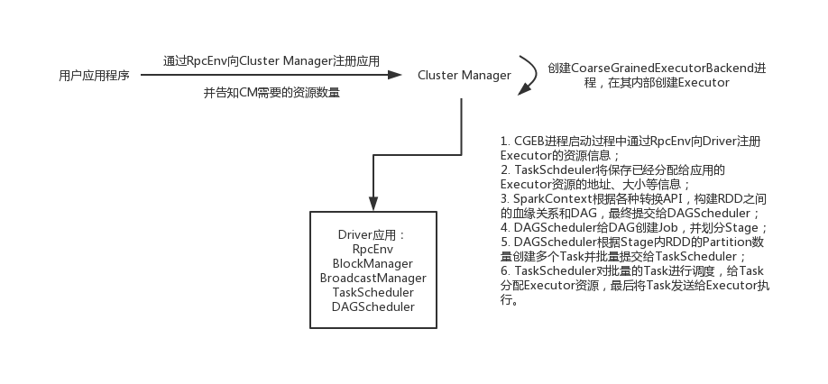

### Spark模块设计
>* 基础设施：SparkConf、RPC框架(Netty实现)、事件总线(ListenerBus)、度量系统(由Source和Sink构成，对集群运行期状态进行监控)；
>* SparkContext: 屏蔽底层内容，给开发人员提供API完成功能开发；
>* SparkEnv:封装了RpcEnv、序列化管理器、广播管理器、MapOutputTracker、存储体系、度量系统、输出提交协调器等Task运行所需要的组件；
>* 存储体系：内存存储空间和执行存储空间的边界可以是软边界，同时还由Tunsten的实现，直接操作操作系统内存；
>* 调度系统：DAGScheduler和TaskScheduler组成，DAFScheduler负责创建Job，划分Stage，给Stage创建Task，批量提交Task等。TaskScheduler负责按照
FIFO/Fair等调度算法对Task进行调度，为Task分配资源；将Task发送到集群管理器的当前的应用的Executor上，由Executor负责执行等工作；
>* 计算引擎：MemoryManager、Tungsten、TaskMemoryManager、Task、ExternalSorter、ShuffleManager等组成。

### Spark模型设计
#### Spark编程模型

#### RDD计算模型
Spark的 计算过程主要是RDD的迭代计算过程，RDD的迭代计算过程，每个分区的数据只会在一个Task中计算。结合[前文](./spark_base.md)理解。
